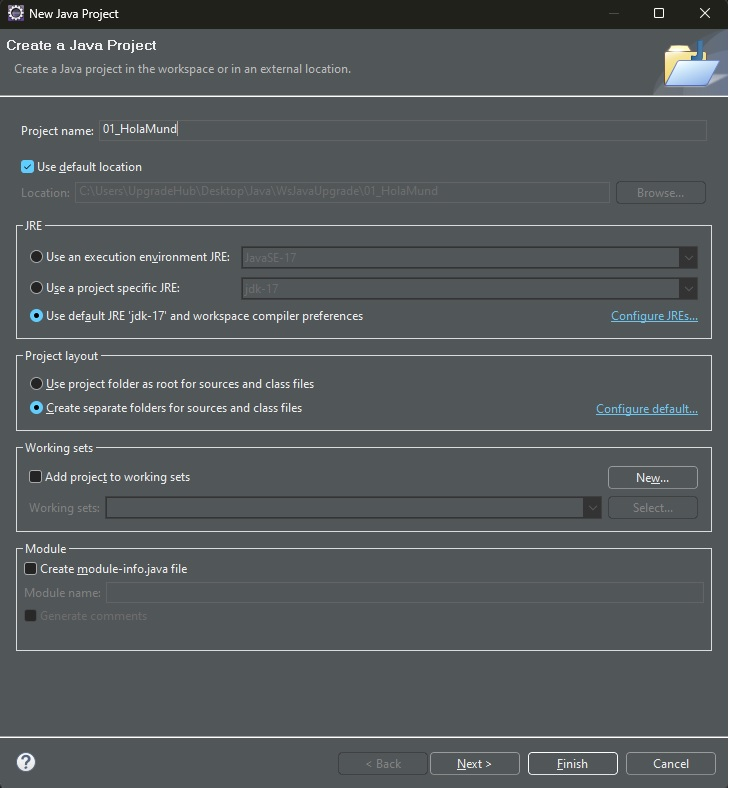
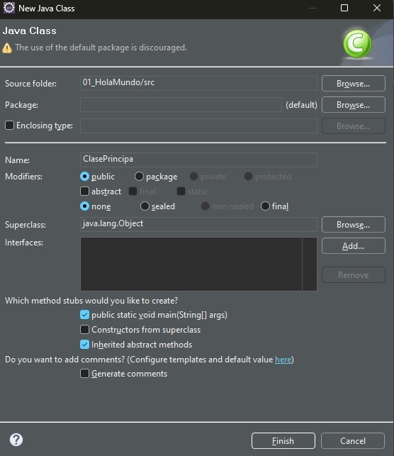

# Hola Mundo en Java

Para hacer un proyecto Java en eclipse debemos de hacer los siguientes pasos:

1. File | new | Java Proyect (Si no aparece, elegir "other" y luego "Java Proyect")
2. Aparecera una ventana modal, donde elegir el nombre del proyecto y la versión de Java que queremos usar. Deseleccionamos las otras opciones. Como se ve en la imagen a continuación

3. Creamos una clase en Java, para ello seleccionamos File | new | Class, dentro de la carpeta de "src". Elejimos las siguientes opciones

4. Imprimir por pantalla el hola mundo, mediante al funcion

	System.out.println("Hola Mundo");
	
5. Para ejecutar un programa en Java, tenemos muchas maneras, una de ellas es boton derecho sobre el fichero que queremos ejecutar, luego "Run as" y luego "Java Application"

6. Por la consola de eclipse deberemos de ver la salida del programa.