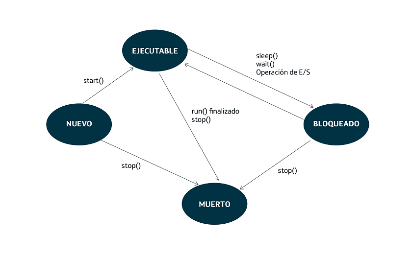

# Hilos

Los hilos estan asociados a un <b>proceso</b> de nuestro sistema operativo. La definición de proceso es un programa en ejecución. Puesto que un proceso está en ejecución, está consumiendo recursos del sistema. Por ejemplo, cuando abrimos un navegador, ejecutamos dicho programa por lo que se abrirá un proceso en nuestro sistema.

Crear un proceso en un ordenador implica los siguientes cambios:

- La reserva de una determinada memoria de trabajo.
- Carga de trabajo para el procesador, que tendrá que ir ejecutando las instrucciones incluidas en el proceso.
- Cambios de estado del proceso, que se reflejan en los valores de los registros de la CPU.

Los procesos se pueden ver en ejecucion en el sistema operativo, en windows por ejemplo los podemos ver dentro del administrador de tareas.

Un <b>hilo</b> es la unidad mínima de procesamiento y se encuentra dentro de un proceso. Es decir, un conjunto de instrucciones en ejecución dentro del contexto de un proceso. 

Todo proceso tendrá al menos un hilo en ejecución, aunque podría tener varios simultáneos, creando lo que se denomina multitarea.

Hay que tener claro que el sistema operativo tiene control sobre los procesos, pero NO sobre las hilos de una manera directa

Esto nos lleva a distinguir entre los conceptos de multiproceso y multitarea.

- <b>Multiproceso</b>: varios procesos que se ejecutan de manera concurrente y que son gestionados por el sistema operativo.
- <b>Multitarea</b>: varios hilos de ejecución simultáneos dentro del mismo proceso.

Nosotros en esta lección nos vamos a centrar en los sistemas multitarea.

## Sistemas multitarea 

Estos sistemas tienen una serie de características:

- Varios hilos en ejecución dentro del mismo proceso.

- Todos los hilos comparten los recurso que el sistema operativo haya asignado al proceso. La incorporación de un hilo más no supone la asignación de más recursos del sistema. 

- Si el ordenador dispone de varios núcleos, cada hilo en ejecución puede aprovechar un núcleo distinto, produciéndose así la multitarea en el sentido estricto de la palabra.

- El uso de varios hilos de ejecución en un proceso es especialmente interesante en los programas en red de tipo cliente/servidor. Un hilo de ejecución puede estar atendiendo peticiones y, si el procesamiento de la respuesta es largo, podría generarse un hilo independiente para cada respuesta. De este modo, se podría estar atendiendo varias peticiones al mismo tiempo.

## Beneficios de un sistema multitarea

Uno de los mayores beneficios que tiene la programación multitarea es el poder reducir de manera considerada los tiempos de ejecución de una aplicación.

Supongamos que estamos haciendo una aplicación que para acabar tiene que hacer 3 tareas:

- Tarea A: Procesar unos ficheros de texto para guardar la información en base de datos. Supongamos que el tiempo de duracion de esta tarea es de 25 segundos.
- Tarea B: Mandar un numero indeterminado de emails a nuestros clientes. Supongamos que el tiempo de duracion de esta tarea es de 20 segundos.
- Tarea C: Hacer calculos estadisticos e informes para enviar a nuestros directores. Supongamos que el tiempo de duracion de esta tarea es de 15 segundos.

En una situacion normal en la que no hay multitarea (una aplicación normal en Java), es decir, en la que solo hay un hilo de ejecución, la duración total de la aplicación sería de 60 segundos. En esta situación irian ejecutandose las tareas de manera secuencial (no empezaría la tarea B a ejecutarse hasta que no acabe la tarea A).

En una situación en que que hay multitarea, es decir, en que hay creamos varios hilos de ejecución (en este caso 3 hilos, cada uno asociado a una tarea), la duración total seria la de la tarea con mayor duración, en este caso 25 segundos, habiendo reducido el tiempo a menos de la mitad. En esta situación irian ejecutandose las tareas de manera paralela.

Por supuesto habría que tener en cuenta que nuestro ordenador a nivel de hardware tuviera hilos suficientes para ejecutar todos nuestros hilos en paralelo, de nada serviria hacer programación multitarea si ejecutamos el codigo en un ordenador antiguo con un solo hilo de procesamiento.

## Hilos en Java

Existen dos maneras de declarar y configurar hilos en Java: 

- Crear una clase que extienda de la clase Thread (herencia)

- Crear un clase que implemente la interfaz Runnable (interfaces)

Ademas existen muchos metodos estaticos asociados a la clase Thread que nos van a ayudar:

- sleep(X): Duerme el hilo por el que esta pasando el programa X milisegundos
- start(): Arranca un hilo, ejecutando su metodo run(). El hilo acabará cuando salga del metodo run().
- currentThread().getName(): Nos da el nombre el hilo que esta pasando por el programa.

Existen muchos mas metodos que podemos ver en la documentacion oficial.

En el paquete 01_basico podemos encontrar ejemplos sobre los hilos en java

## Estados de un hilo

)

La imagen refleja los distintos cambios de estados por los que pasa un hilo y los métodos que pueden provocar dichos cambios. Un hilo nuevo pasa a ejecutable por la invocación al método start(). Por otro lado, puede pasar de ejecutable a bloqueado por la invocación a los métodos sleep(), wait(), o a la espera de una operación de entrada/salida, volviendo de nuevo al estado ejecutable cuando llegue el momento.

Un hilo pasa a estar muerto en la mayoría de los casos cuando ha terminado de ejecutarse el método run() y, por consiguiente, ya cumplió su misión, pero también podría pasar a estado muerto por la ejecución del método stop(), que interrumpe el hilo, o por otro tipo de interrupción inesperada.

## Hilos sincronizados en Java

Cuando estamos trabajando con hilos podemos tener problemas de sincronización entre ellos o lo que es lo mismo problemas cuando dos hilos acceden simultaneamente a la misma posición de memoria.

Varios hilos podrían compartir información accediendo a la misma variable, objeto, fichero, etc. Esto podría crear zonas críticas, es decir, áreas de código que podrían crear problemas de concurrencia.

Para indicar que un fragmento de código está sincronizado, es decir, que solamente un hilo puede acceder a dicho método a la vez se utilizara el modificador "synchronized" que se utiliza para indicar que un fragmento de código está sincronizado, es decir, que solamente un hilo puede acceder a dicho método a la vez. 

Se podría afirmar que un método sincronizado tiene una marca de abierto y cerrado: cuando está cerrado ningún otro hilo puede entrar en dicho método.

La clave de la sincronización está en la palabra <b>monitor</b>. Como hemos comentado anteriormente, sólo un hilo de ejecución puede acceder a un método sincronizado al mismo tiempo; se dice que ese hilo es el que tiene el monitor y tendrá bloqueado el proceso hasta que finalice su ejecución y lo libere.

Podemos ver los ejemplos 03 de este proyecto para ver ejemplos sobre la sincronización de hilos.

## Wait y Notify

Los métodos wait() y notify() pertenecen a la clase Object, por consiguiente, todos los objetos cuentan con ellos ya que todos las clases herendan de la clase Object.

El método wait() deja bloqueado el hilo que lo llama, hasta que es liberado por otro hilo por medio de la ejecución del método notify(). Siempre que se haga un notify() a un objeto despierta a todos los hilos que estan en estado de wait() dentro del mismo objeto.

Los metodos wait() y notify() solamente se pueden llamar dentro de un metodo o bloque sincronizado. En caso de que se usen fuera de bloques o metodos sincronizados daría la excepcion <b>java.lang.IllegalMonitorStateException</b>

El método wait() esta sobrecargado y admite tambien un parametro de entrada en el que le pasamos un número de milisegundos, en caso de que pase dicho numero de milisegundos y ningun hilo haya ejecutado un notify sobre el objeto, entonces el hilo seguira su ejecución.

Podemos ver el ejemplo 04 para ver un sistema de productores y consumidores usando los metodos wait() y notify().

## Bibliografia
https://docs.oracle.com/en/java/javase/11/docs/api/java.base/java/lang/Thread.html

