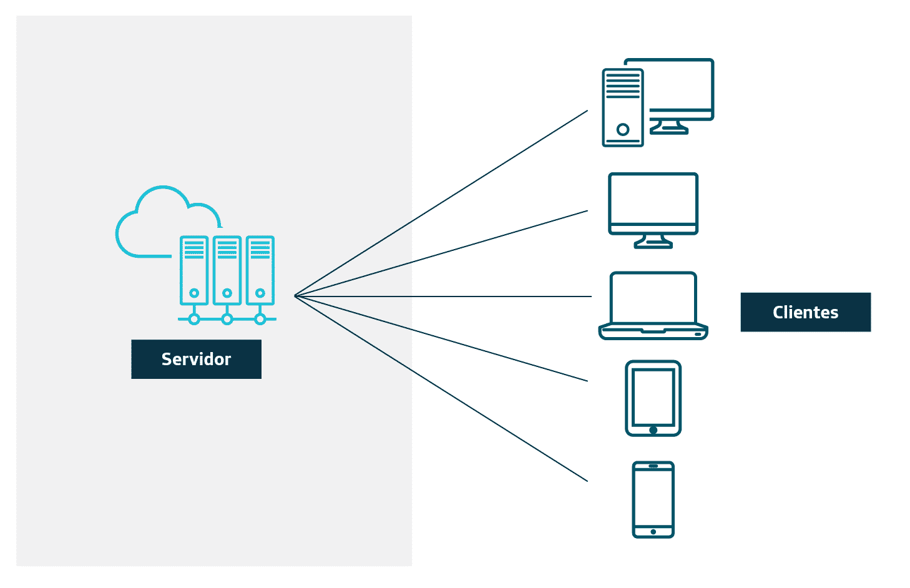
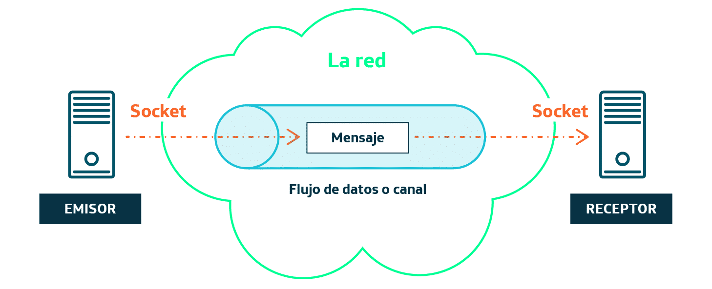
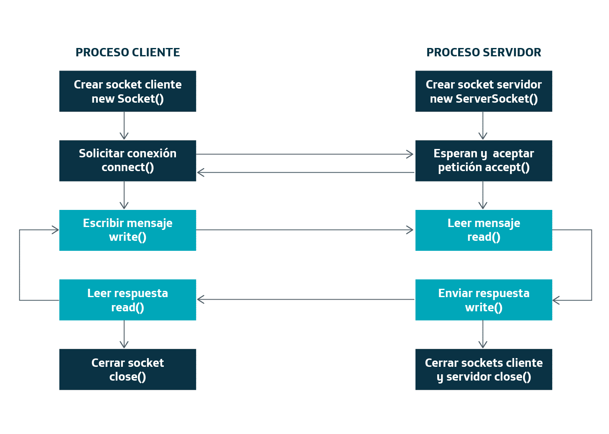
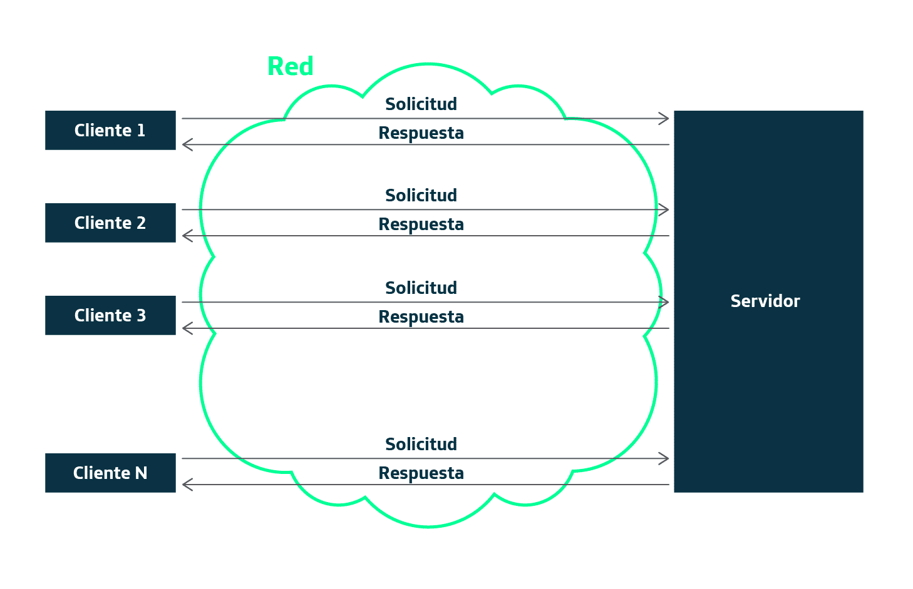

# Sockets y desarrollo de aplicaciones Cliente-Servidor. 

Con estos ejemplos vamos a abordar los sockets y cómo podemos aplicarlos dentro de una arquitectura de cliente servidor.

## Programación distribuida. Modelo cliente-servidor

Es muy habitual encontrarnos programas que no están centralizados en una única aplicación, sino que están distribuidos en varias aplicaciones para realizar la funcionalidad.

La programación distribuida hace referencia a las aplicaciones que tienen sus programas distribuidos en distintos equipos conectados a través de la red. Los diferentes programas colaboran entre sí para alcanzar un objetivo común.

En este tipo de programaciones podemos encontrarnos una de las más extendidas que será el modelo cliente-servidor, en el cual tenemos varias aplicaciones cliente que se conectan a un solo servidor (en principio, aunque también podemos tener muchos servidores si necesitamos que nuestro sistema sea escalable).

En este modelo las tareas serán repartidas de la siguiente manera:

1. <b>El servidor:</b> como proveedor o suministrador de recursos. Sus funciones serán:
    - Aceptar las peticiones de los clientes.
    - Analizar la petición del cliente e interactuar con el resto de las capas del sistema (capa de datos, capa lógica) para poder responder a la petición.
    - Generar la respuesta para el cliente.
    - Enviar la respuesta al cliente.
2. <b>El cliente:</b> como consumidor de los recursos que provee el servidor.
    - Suele Interactuar con el usuario.
    - Realiza peticiones al servidor.
    - Recibe los resultados del servidor.
    - Presenta los resultados al usuario o a otros procesos que lo requieran.

### Características del modelo cliente servidor

1. Los clientes inician una comunicación con el servidor a través de un protocolo y el servidor responde. Los sockets pueden utilizar el protocolo TCP/IP (protocolo orientado a conexión) o el protocolo UDP (protocolo orientado a NO conexión). En nuestros ejemplos vamos a ver los sockets orientados a conexión.
2. El servidor presta los recursos y servicios al cliente que los consume.
3. El cliente no tienen por qué saber dónde se encuentran los recursos que consume. Simplemente le hace peticiones al servidor siendo como una caja negra para él, es decir, existe encapsulamiento de los servicios prestados por el servidor.
4. Se utilizan tecnologías que permitan independencia de la plataforma, tanto del cliente como del servidor. Es decir, el servidor puede estar hecho con Java y el cliente con PHP. El ejemplo más claro son los servidores web y los navegadores. En nuestro caso tanto el cliente como el servidor estar hecho en Java pero no tendrá por qué ser así.
5. Los sistemas deben ser escalables para garantizar la posibilidad de crecimiento y la adaptación a cambios imprevistos.

## Sockets

Los sockets proveen de un mecanismo para la comunicación entre dos procesos que pueden encontrarse en distinta máquina. 

Ofrecen una abstracción de la pila de protocolos IP que permite al programador olvidarse de los detalles técnicos de más bajo nivel en las comunicaciones a través de la red.

La traducción literal de socket es "enchufe" y representa un extremo de un canal o flujo de datos que comunicará dos procesos.

El uso de sockets es fundamental en los sistemas distribuidos donde una aplicación está compuesta por varios programas situados en diferentes equipos conectados a través de la red que colaboran y se comunican entre ellos para conseguir un objetivo común.

Podemos observar cómo dentro de cada aplicación (la app cliente y la app servidor) tendremos un socket (uno en cada extremo), que serán los encargados de mantener el flujo de datos (streams) entre ambas aplicaciones y por donde se intercambiarán los mensajes para establecer la comunicación.

Para conectar las dos aplicaciones normalmente el cliente hace una petición TCP/IP a la aplicación servidora, por lo que debemos de conocer la IP de donde se encuentra el servidor y el puerto por el cual está escuchando dichas peticiones.

## Flujo de datos

Toda la información que se trasmite a través de un ordenador fluye desde una entrada hacia una salida. Para transmitir información, Java utiliza unos objetos especiales denominados streams (flujos o corrientes).

Podemos entender el flujo de datos como una carretera o autopista con dos carriles que conecta dos ciudades, uno para cada sentido, el cual tenemos camiones que van viajando de una ciudad a otra. Las ciudades serán las dos aplicaciones, la aplicación cliente y la aplicación servidora. Los camiones transportarán la información que queremos mandar entre las dos ciudades. Por último, los dos carriles que tendríamos serán el medio para intercambiar información (el flujo de datos o canal), uno para mandar información de la “Ciudad A” a la “Ciudad B” y el otro para mandar información de la “Ciudad B” a la “Ciudad A”.

Los streams permiten transmitir secuencias ordenadas de datos desde un origen a un destino. Para transmitir información de un ordenador a otro, necesitamos un socket a cada extremo y cada uno de estos sockets suministrará un flujo de entrada o salida para realizar la transferencia.

## Sockets y Java

Java dispone de dos grupos de flujos de datos.

1. <b>InputStreams:</b> Para recibir los datos desde otro socket emisor.
2. <b>OutputStreams:</b> Para emitir datos hacia otro socket receptor.

Todo proceso de lectura o escritura de datos consta de tres pasos:

1. Abrir el flujo de datos de lectura o de escritura.
2. Leer o escribir datos a través del flujo abierto.
3. Cerrar el flujo de datos.

Todas las clases que representan flujos de datos están ubicadas en el paquete <b>java.io</b> de java. Podemos encontrar las siguiente clases, dentro de las más importantes:

1. <b>Socket:</b> es la clase que nos va a permitir comunicarnos con el servidor. Aquí creamos un objeto socket con la IP y el puerto por el que vamos a conectarnos al servidor. En el servidor se creará otro objeto socket que se enlazará con este mediante TCP/IP. 
2. <b>InputStreamReader:</b> Entrada de datos. Es el canal de entrada para recibir los datos de otro socket. Normalmente nos apoyaremos en otro objeto llamado <b>BufferedReader</b> que permite hacer lecturas más sencillas.
3. <b>PrintStream:</b> Salida de datos. Es el canal de salida para mandar datos hacia otro socket.
4. <b>ServerSocket:</b> Este objeto es el que estará escuchando peticiones por un puerto y creará un objeto Socket por cada petición. Este objeto solamente está en el lado del servidor y tiene el  método <b>accept()</b> el cual deja el hilo a la espera de que algún cliente le haga una petición para crear el objeto Socket y poder continuar con la ejecución. 
5. <b>InetSocketAddress :</b> Objeto que utilizaremos para encapsular la IP y el puerto.
		
## Diagrama de Streams y Sockets en java

Podemos entender el flujo de una aplicación cliente-servidora de la siguiente manera. En los ejemplos esta también explicado.

Nótese que si no cerramos el socket ni en el servidor ni en el cliente, la comunicación se mantendrá abierta y podríamos estar continuamente utilizando los objetos streams para mandar información.

## Ejemplo sockets

En los ejemplos SocketClient y el SocketServer vamos a ver cómo crear aplicaciones cliente-servidor mediante Sockets. Son dos aplicaciones diferentes tal y como hemos visto hasta ahora.

Como primer ejemplo vamos a ver las clases <b>SocketCliente.java</b> y <b>SocketServidor.java</b>, que representan un ejemplo de cómo recoger dos números en el cliente y mandárselos a un servidor para que los sume. Cada vez que arrancamos el SocketCliente.java haría una conexión al servidor y luego se parará, mientras que el servidor será común a todos los clientes y nunca dejará de estar arrancado.

Como segundo ejemplo, vamos a ver las clases <b>SocketClienteRepetitivo.java</b> y <b>SocketServidor.java</b>. En este caso el servidor funciona exactamente igual, pero en el caso del cliente, no parará el programa hasta que el usuario lo diga, y se creará un nuevo objeto Socket cada vez que mandemos dos números para sumar.

## Hilos y Sockets	

En los servidores de aplicaciones es muy habitual el uso de hilos en los programas y eso es debido a las propias limitaciones de los sistemas con un solo hilo de ejecución.

Hay que tener en cuenta que si no usamos hilos en nuestro servidor SOLAMENTE podrá atender a un cliente al mismo tiempo, es decir, hasta que no acabe de procesar una petición no volverá el servidor a aceptar otras peticiones (hasta que el hilo principal del servidor no vuelva a la línea donde se invoca el método <b>accept()</b>).

De esta manera, si queremos hacer programación paralela y poder procesar varias peticiones de diferentes clientes, <b>deberemos de abrir un nuevo hilo por cada petición</b> y que sea esta la que se encargue de las comunicaciones con el cliente.

Supongamos que, el ejemplo anterior que hemos visto tardara mucho en ejecutarse, por ejemplo, que, en vez de calcular la suma de dos números, que es una tarea muy sencilla a nivel de procesador, fuera el cálculo de saber si un número es primo o no, la cual puede llevar mucho tiempo de cálculo. Si utilizamos un solo hilo de ejecución y tuviéramos varios clientes haciendo peticiones al servidor, se creará una cola de peticiones de manera natural, por lo que los últimos clientes en hacer la solicitud verán como el servidor les tarda en responder una cantidad de tiempo anormal.

En este ejemplo vamos a ver las clases <b>SocketClienteHilo.java</b> y <b>SocketServidorHilo.java</b>, que representan un ejemplo de cómo queremos que el servidor nos responda cuantos caracteres tiene una frase que les mande un cliente. El cliente nos podrá mandar frases continuamente hasta que nos mande la palabra "FIN", que será cuando se corte la comunicación. En este caso, aunque la idea sea la misma que en el ejemplo anterior (segundo ejemplo), la manera de implementarlo es diferente, ya que en este caso NO se abre un socket en el lado cliente y servidor por cada petición del cliente, sino que el cliente abre una conexión al principio y los socket permanecen abiertos hasta que el cliente escriba la palabra "FIN".

Para solventar el problema de que ningún otro cliente pueda conectarse al servidor hasta que el cliente anterior haya cerrado la comunicación, vamos a hacer que el <b>SocketServidorHilo.java</b> abra un hilo nuevo de la clase <b>HiloContadorLetras.java</b> que será en el encargado de mantener el socket abierto, liberando así el hilo principal pudiendo aceptar peticiones nuevas. Por cada petición de un cliente nuevo, el servidor creará un hilo nuevo asignado a dicha petición.

Esta es la manera de trabajar de todos los servidores de aplicaciones, para poder así dar soporte al mayoría de clientes posibles (Páginas web, videojuegos, etc.).

