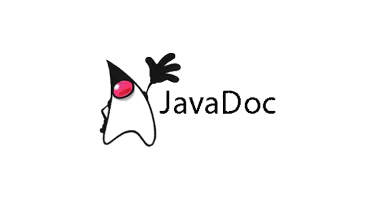

# JavaDoc

JavaDoc es una utilidad de Oracle para la generación de documentación en formato HTML a partir de código fuente Java. JavaDoc es el estándar de la industria para documentar clases de Java. La mayoría de los IDEs los generan automáticamente.

## Objetivos

El objetivo de JavaDoc es el de proporcionar información a otro desarrolladores de como tienen que utilizar nuestros clases y métodos. Esta documentación no es para nosotros (que también), es principalmente para los programadores que usen nuestro código.

Es fundamental entender que con la documentación queremos dar a conocer la función que realizan nuestras clases y métodos sin necesidad de meternos en el código fuente de las clases para entender lo que hace.

No confundir JavaDoc con los comentarios normales de java, que estos empiezan por ** /* ** y suelen ir dentro de los métodos para explicar el código. 

Es muy importante entender la diferencia entre los comentarios normales y JavaDoc. El objetivo de los comentarios normales es explicar líneas de código a programadores que se meten a ver el código fuente, el objetivo de JavaDoc es explicar a otros programadores como deben de usar las clases y los métodos que hemos realizado, sin necesidad de ver el Código fuente ni de entenderlo.

En el siguiente enlace podemos ver un ejemplo resultante de una documentación hecha para la clase [String](https://docs.oracle.com/en/java/javase/11/docs/api/java.base/java/lang/String.html). En esta documentación, realizada con JavaDoc por la gente de Oracle, podemos ver como se nos explica perfectamente toda la clase **String** y todos los métodos que tiene. Este será nuestro objetivo cuando realizamos JavaDoc en nuestras clases.

A su vez, la documentación está muy ligada con las pruebas unitarias, hasta tal punto de que, si la documentación está bien hecha, podemos hacer las pruebas unitarias sin necesidad de entender el código.

Una buena práctica sería documentar el código antes de implementarlo.

## Creación de JavaDoc

El JavaDoc se crea dentro de las clases de java y tendrá la siguiente forma:

	/** 
	* DOCUMENTACION
	*
	* ANOTACIONES 
	*/ 
    
	Nótese que JavaDoc empieza con "/**", es decir, una barra y dos asteriscos. El cierre de JavaDoc es con "*/"

El JavaDoc <b>DEBERA IR</b> al principio de cada clase, atributo, constructor o método, dependiendo de qué parte se quiera documentar.

## Anotaciones en JavaDoc

Para generar API con JavaDoc podemos usar ciertas palabras reservadas precedidas por el carácter "@" que son llamadas <b>anotaciones</b>. El objetivo de las anotaciones es la de enriquecer la documentación y de organizarla de una manera estándar. Cada anotación representa un valor diferente y tenemos distinto tipos.

Veamos las principales anotaciones que existen:

<table style="border: 1px solid">
 	<tr><th>ANOTACION</th><th style="text-align:left">DESCRIPCION</th></tr>
 	<tr><td style="font-weight:bold">@author</td><td>Nombre del desarrollador</td></tr>
	<tr><td style="font-weight:bold">@version</td><td>Versión del método o clase</td></tr>
	<tr><td style="font-weight:bold">@param</td><td>Definición de un parámetro de entrada de un método, es requerido para todos los parámetros del método</td></tr>
	<tr><td style="font-weight:bold">@return</td><td>Informa de lo que devuelve el método, no se puede usar en constructores o métodos "void"</td></tr>
	<tr><td style="font-weight:bold">@throws</td><td>Excepción lanzada por el método, primero la clase y luego la explicación</td></tr>
	<tr><td style="font-weight:bold">@see</td><td>Asocia con un elemento externo como un método, una clase o cualquier recurso en la red. Varias maneras de hacer referencia -> #metodo(); clase#metodo(); paquete.clase; paquete.clase#metodo(). Tambien podemos usar la anotacion @link (ver más abajo)</td></tr>
	<tr><td style="font-weight:bold">@since</td><td>Usado principalmente en metodos. Nos dice desde que versión de la clase se encuentra el método en dicha clase</td></tr>
	<tr><td style="font-weight:bold">@link</td><td>Para crear un hipervinculo sobre un texto dentro del mismo programa. Si queremos usar hipervínculos externos podemos usar la etiqueta A de HTML.</td></tr>
	<tr><td style="font-weight:bold">@deprecated</td><td>Indica que el método o clase es antigua y que no se recomienda su uso porque posiblemente desaparecerá en versiones posteriores</td></tr>
</table>

Estas anotaciones se escriben dentro del JavaDoc, Ej.

    /**
    *
    * @author Steven Grant Rogers
    *
    */

Dentro del código veremos más ejemplos con mayor detalle.

## Enriquecer el JavaDoc con HTML

Dentro de un comentario de JavaDoc, se pueden poner etiquetas HTML para enriquecer el formato. JavaDoc acepta la mayoría de ellas.

    /**
    * El objetivo de esta clase es proporcionar una <b>comunicación con una impresora</b>
    *
    * @author Steven Grant Rogers
    *
    */

## Documentación de una clase

El objetivo de documentar una clase es informar de la funcionalidad y la finalidad de dicha clase.

Son importantes anotaciones como <b>@author o @version</b>.

Primero habría que documentar la clase y luego poner las anotaciones que estimemos oportunas.

    /**
    * El objetivo de esta clase es proporcionar una <b>comunicación con una impresora</b>
    *
    * Tendrá diferentes métodos para realizar acciones con la impresora, tales como
    * <u>imprimir, escanear o fotocopiar</u>.
       
    * @author Steven Grant Rogers
    * @version 1.0
    *
    */
    public class GestionImpresora {
    
    
    }

Nótese como la documentación esta justo arriba de la clase que queremos documentar

## Documentación de atributos

El objetivo de documentar atributos es la de informar de lo que representa el atributo. Se puede añadir posibles valores, unidades, etc.

Para cada uno de los atributos, primero habrá que documentar el atributo y luego poner las anotaciones que estimemos oportunas.

## Documentación de un método

Documentar métodos es de las partes más importantes de JavaDoc, y el objetivo es el de explicar perfectamente lo que hace el método, con todas sus casuísticas posibles o resultados.

Son muy importantes las anotaciones <b>@param</b> para cada uno de sus parámetros o <b>@return</b> para explicar los posibles valores que devuelve. Puede haber varios <b>@param</b> (uno para cada parámetro de entrada), pero como máximo habrá UN SOLO <b>@return</b> (y no lo habrá en caso de que el método devuelva <b>”void”</b>).

Primero habría que documentar el método y luego poner las anotaciones que estimemos oportunas.

	 /**
	  * Método que establece el valor al atributo titulo. El titulo pasado por parámetro no pude 
	  * ser nulo ni estar vacío. En caso de que sea nulo, vacío o tenga espacios en blando
	  * únicamente, el método arrojara una excepción.
	  *
	  * @param titulo El nuevo título que queremos establecer
	  * @throws IllegalArgumentException Si titulo es <b>null</b>, está vacío o contiene sólo espacios en blanco	
	  */
	 public void setTitulo (String titulo) throws IllegalArgumentException
	 {
	   if (titulo == null || titulo.trim().equals(""))
	   {
	       throw new IllegalArgumentException("El título no puede ser nulo o vacío");
	   }
	   else
	   {
	       this.titulo = titulo;
	   }
	 }

Nótese que solo ponemos un <b>@param</b> porque solo hay un parámetro de entrada y no ponemos <b>@return</b> porque el método es “void” y no retorna nada. También observamos como la documentación esta justo encima del método que queremos documentar.

<b>¡IMPORTANTE!</b> Los setter y los getter normalmente NO se comentan. Solo se comentan en caso de que hagan alguna funcionalidad diferente a lo que hace por defecto (asignar o devolver valores de atributos). Un ejemplo podría ser el método anterior <b>setTitulo</b>, normalmente no se documentará, pero en este caso SI que sería obligatorio hacerlo ya que hace una funcionalidad diferente al “setTitulo” por defecto que nos crearía un IDE como eclipse.

## Documentación de constructores

Los constructores también se pueden documentar. Siguen las mismas reglas que los métodos, pero teniendo en cuenta que no se puede poner la anotación <b>@return</b> ya que los constructores no devuelven nada. 

## Generar ficheros de documentación de manera automática (HTML)

Una vez aplicado el JavaDoc sobre el código, podemos generar documentos html de manera automática con toda la información que hemos puesto sobre dicho código. La documentación quedará como la documentación oficial de Oracle, [documentación oficial String](https://docs.oracle.com/en/java/javase/11/docs/api/java.base/java/lang/String.html) 

Para hacerlo con Eclipse debemos de realizar los siguientes casos.

1. Ir a la siguiente pestaña de eclipse: Proyect -> Generate JavaDoc
	
2. Elegiremos el proyecto el cual queremos generar su documentación. Nos dan muchas opciones de creación de JavaDoc, normalmente con elegir las opciones por defecto son suficientes.

3. Si nos da un error de tipo "javadoc command does not exist" debemos de buscar en dicha pantalla la ruta del ejecutable para que nos genere la documentación. El ejecutable que podemos escoger por defecto seria "javadoc.exe" que se encuentra donde tengamos instalado nuestra jdk de java. Un ejemplo de la ruta por defecto podría ser -> C:\Program Files\Java\jdk-11.0.11\bin

## Como ver los ejemplos

1. Ver la clase <b>basico/ClaseJavaDoc</b> para ejemplos teóricos de cómo hacer documentación

2. En la clase <b>basico/MainJavaDoc</b> hay ejemplos de cómo usar la clase anterior y cómo podemos ver el JavaDoc hecho poniendo el cursor encima de la clase o los métodos

3. En el paquete <b>entidad</b> hay ejemplos más prácticos de cómo hacer documentación

## Bibliografía

- [https://es.wikipedia.org/wiki/Javadoc](https://es.wikipedia.org/wiki/Javadoc)
- [https://www.oracle.com/technical-resources/articles/java/javadoc-tool.html](https://www.oracle.com/technical-resources/articles/java/javadoc-tool.html)
- [https://www.markdownguide.org/extended-syntax/#tables](https://www.markdownguide.org/extended-syntax/#tables)

