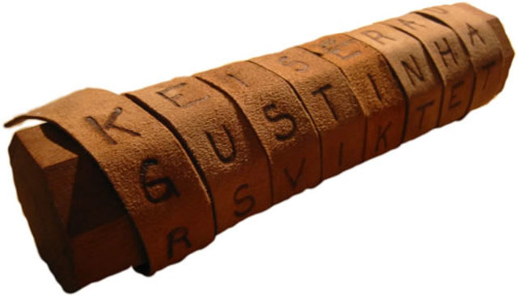
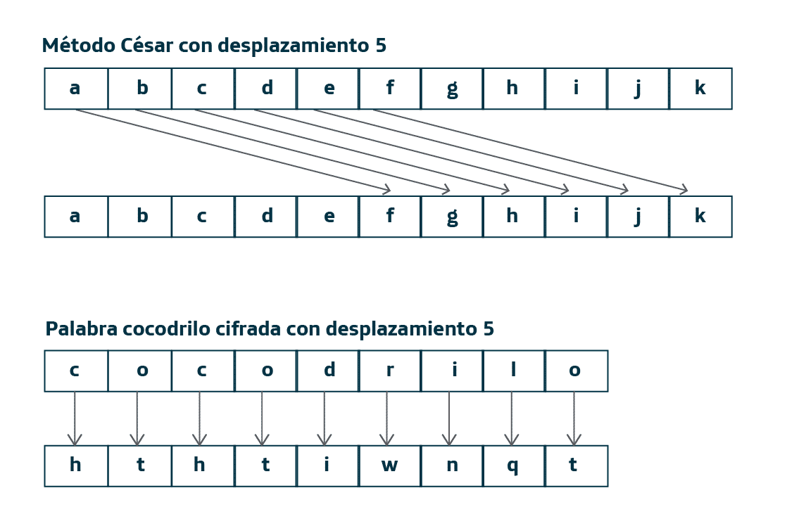
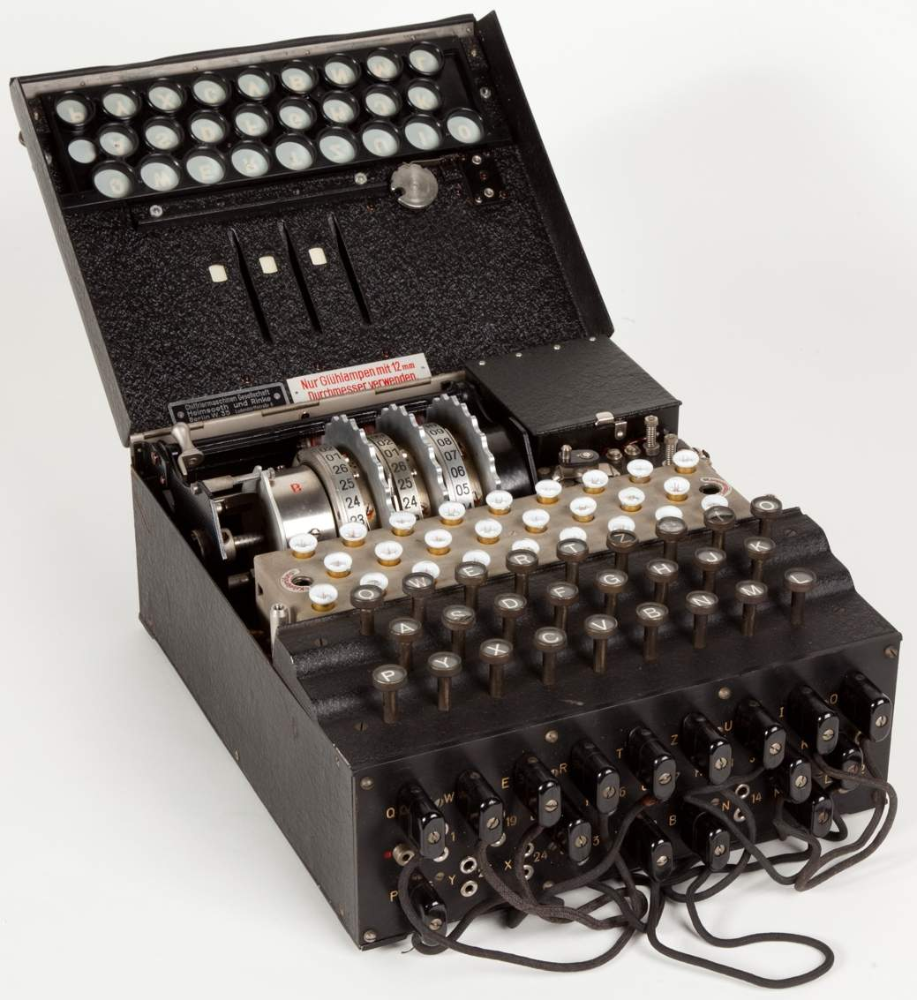
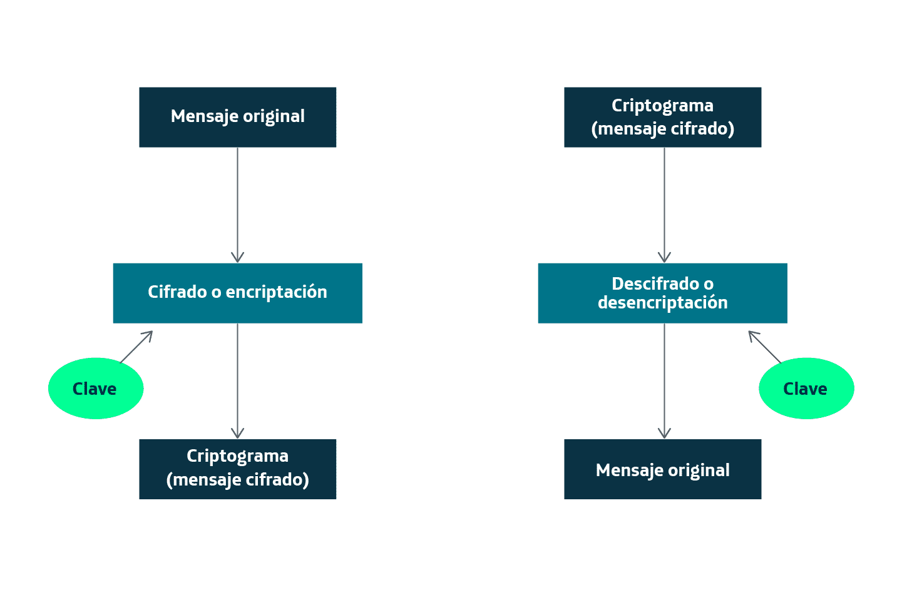
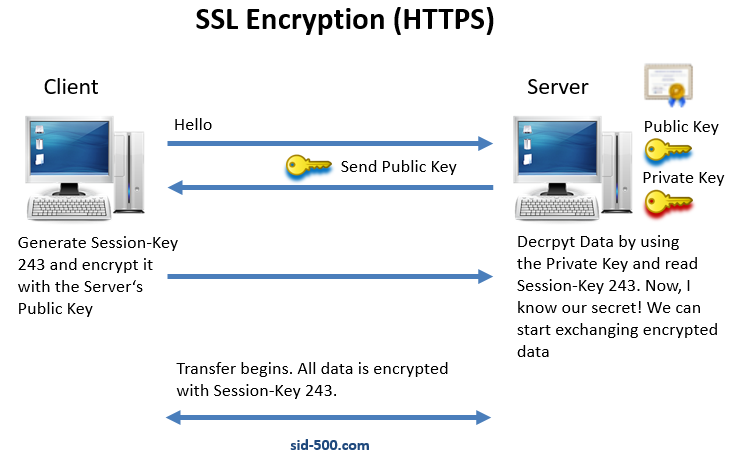

# Criptografía

La criptografía es la ciencia que estudia las distintas técnicas que se pueden utilizar para proteger documentos y datos, transformándolos por medio de algún tipo de codificación secreta.

La palabra criptografía proviene de la unión de dos palabras de la lengua griega:
- Kryptos: oculto.
- Graphia: escritura.

Para los sistemas informáticos, la criptografía tiene como objetivo ocultar la información a personas o programas no autorizados, que no sólo podrán leerla, sino incluso manipularla con objeto de modificar su contenido.

## Usos de la criptografía

La criptografía se viene empleando desde tiempos inmemoriales. En las antigua Grecia y Roma ya se creaban criptogramas (mensajes cifrados) para cuestiones diplomáticas, órdenes militares, informes sobre actividades de espionaje o documentos de políticos. A lo largo de la historia el hombre ha inventado varios sistemas criptográficos. Veamos a continuación algunos ejemplos:

### La escítala espartana. 

Fue el primer método de encriptación de la historia. La idea consistía en enrollar un papiro en una escítala (una palo con muescas) y escribir un mensaje por una de sus caras. Luego se desenrollaba el papiro y se enviaba a un receptor. Dicho receptor enrollaba el mensaje en una escítala exactamente igual que la primera para poder leer el mensaje.

### El método César. 

Se denomina así porque fue utilizado por Julio César. Es muy sencillo: consiste en sustituir cada letra por otra situada varias posiciones más adelante dentro del alfabeto. El número de posiciones es lo que llamamos desplazamiento.

### La máquina enigma

La máquina Enigma comenzó a utilizarse en la Segunda Guerra Mundial por los alemanes para cifrar sus mensajes secretos. Con cada tecla pulsada, unos rotores giraban, modificando dicha tecla por otra distinta seleccionada por la máquina a través de diferentes reglas complejas.

Fue Alan Turing, un científico británico, quien logro descifrar los códigos alemanes utilizados en la máquina Enigma, contribuyendo así a la derrota nazi.

## Concepto de encriptación

La encriptación es el proceso que hace posible la criptografía, es decir, el proceso necesario para volver ilegible dicha información para terceros. Aquí tenemos varios conceptos:

1. <b>Encriptar.</b> Proceso por el cual volvemos ilegible una información. También llamado **cifrar**.
2. <b>Desencriptar.</b> Proceso de obtener el mensaje original a través del mensaje encriptado. También llamado **descifrar**.
3. <b>Criptograma.</b> El mensaje secreto, es decir, el mensaje escrito en clave o cifrado.

Tanto para encriptar como para desencriptar utilizaremos una <b>CLAVE</b> para realizar la transformación.

## Tipos de clave Criptográfica

Existen dos tipos de claves criptográficas, que son:

- <b>Clave simétrica.</b> Se utiliza la misma llave (o clave) para el cifrado y el descifrado. También se denomina método de clave privada. Este método es el que primero se inventó y ha sido usado durante toda la historia de la humanidad. Como ejemplos podríamos encontrar la escítala espartana, el método cesar o la máquina Enigma. Este método, aunque fiable y robusto, representa un grave problema: ¿Cómo transferimos o distribuimos la clave entre el emisor o el receptor? Es aquí donde entra también el concepto de <b>canal seguro</b>, que es un canal el cual podemos mandar información sin miedo a que sea interceptada. Este problema lo podemos encontrar tanto si el emisor y el receptor son personas como si nos movemos en un entorno de cliente y servidor.

- <b>Clave asimérica.</b> Se utiliza una clave para el cifrado y otra distinta para el descifrado. También se conoce como método de clave pública. En este método tenemos dos llaves (o claves), una se conoce como clave pública (A) y la otra se conoce como clave privada (B). La idea básica es que lo que ciframos con la clave pública SOLAMENTE lo podemos descifrar con la clave privada, y lo que ciframos con la clave privada SOLAMENTE lo podemos descifrar con la clave pública. NUNCA lo que ciframos con una clave lo podemos descifrar con la misma (a diferencia de los métodos con clave simétrica). Tenemos dos principales ramas en la criptografía de clave simétrica, en función de si usamos la clave publica o la clave privada para cifrar, estos son: 

    1. <b>Cifrado con clave pública.</b> Un mensaje cifrado con la clave pública de un destinatario no puede ser descifrado por nadie, excepto un poseedor de la clave privada correspondiente. Su función es **garantizar la confidencialidad del mensaje**.

    2. <b>Cifrado con clave privada.</b> Un mensaje firmado con la clave privada del remitente puede ser verificado por cualquier persona que tenga acceso a la clave pública de dicho remitente, lo que demuestra que este remitente tenía acceso a la clave privada. Se utiliza para **garantizar la autenticidad del mensaje**. Este método es usado para las firmas digitales y es de vital importancia que la clave privada nunca se comparta.

- <b>Clave mixta</b>, realmente no es un tipo de criptografía como tal, simplemente es una combinación de clave simétrica y clave asimétrica. Un ejemplo sería el protocolo **HTTPS**.

### HTTPS

Dentro del protocolo HTTP tenemos también la versión segura, el cual cifra la comunicación entre el cliente y el servidor. La idea básica es usar la clave asimétrica para intercambiar la clave simétrica.

1. El cliente intenta establecer una comunicación con el servidor. El servidor responde que solo acepta comunicación segura (HTTPS).
2. El servidor envía su clave pública al cliente (y su certificado).
3. El cliente **genera una clave simétrica** (que será la que se use para encriptar los futuros mensajes), y la envía al servidor **encriptándola** con la clave publica que le mando el servidor en el paso 2.
4. El servidor recibe el mensaje encriptado con la clave publica y lo desencripta con la clave privada. El servidor es el único que puede desencriptar el mensaje ya que es el único que posee la clave privada, si alguien intercepta el mensaje **no podrá** desencriptarlo, ya que como mucho tendrán la clave pública. Después de desencriptar el mensaje, guarda la clave simétrica para encriptar los mensajes que enviará al cliente. Ahora mismo el cliente y el servidor son los únicos que tienen la clave simétrica (session 243 en el dibujo)
5. La transferencia de información comienza. Todos los mensajes se encriptarán con la clave simétrica (session 243).
6. Para evitar que los atacantes puedan intentar adivinar la clave simétrica, cada cierto tiempo se suele regenerar la clave.

Habría que añadir que, en este proceso, **el servidor envía tanto la clave publica como su certificado digital al cliente** en el paso 2. De esta manera, el cliente puede comprobar que el certificado es válido y que puede confiar en el servidor para intercambiar información. Los navegadores comprueban el certificado consultando a **empresas certificadoras**, si ninguna empresa reconoce el certificado, entonces se avisará al cliente para que el decida si quiere intercambiar información con el servidor.

## Trabajando con la criptografía en Java

Java cuenta con mecanismos para encriptación de información mediante uso de claves. Las clases que permiten desarrollar dichos mecanismos están distribuidas en las siguientes clases Java:
    
- La interfaz <b>java.security.Key</b> representa una clave que puede ser utilizada en la función de cifrado y de descifrado. 

- La interfaz <b>javax.crypto.SecretKey</b> es otra interfaz más concreta que implementa a la interfaz Key.

- La clase <b>javax.crypto.spec.SecretKeySpec</b> es una clase que implementa la interfaz SecretKey.

- La clase <b>javax.crypto.Cipher</b> implementa las funciones de cifrado o descifrado, especificando el tipo de algoritmo utilizado.

## Hash: funciones de resumen

Las funciones de resumen, o funciones hash, disponen de un algoritmo capaz de crear, a partir de una determinada información de longitud variable (entrada), una cadena de longitud fija (salida) que resume dicha información.

Los algoritmos hash garantizan que:

1. La cadena de salida obtenida representa un resumen del mensaje original. A partir de dicho resumen NUNCA se podrá obtener el mensaje original (a diferencia de cuando ciframos, que se puede descifrar). Lo que "hasheamos" no se puede "deshashear" o, dicho de otra manera, a partir del resumen hash, nunca podremos obtener el mensaje original.

2. Para la misma información de entrada, se obtendrá <b>SIEMPRE</b> el mismo resumen hash. Esta regla se cumple siempre y cuando se utilice le mismo tipo de algoritmo.

Para estas técnicas se aplican algoritmos matemáticos. Por ejemplo, si sumamos el número 123 al número 77, el resultado siempre sería 200, pero si intentáramos sacar los 2 números originales a partir del 200 no podríamos hacerlo.

Podemos pasar un algoritmo hash a cualquier información, ya sea un texto, un fichero Excel, un fichero .zip, etc.

Además, un resumen hash tiene aplicaciones muy importantes:

1. <b>Comprobar que un archivo no ha sido modificado y garantizar su integridad</b>. Cuando hay que transmitir mucha información a través de la red, dicha información puede transmitirse junto con el resumen y el tipo de algoritmo utilizado. Una vez que la información llega al destino, puede volverse a generar el resumen con el mismo algoritmo y comprobar si ha habido algún cambio durante la transmisión. 

2. <b>Comprobar contraseñas de manera segura</b>. Las contraseñas NUNCA se deben guardar encriptadas en base de datos, ya que cuando encriptamos un mensaje lo podemos desencriptar. Por ejemplo, un programador usa una clave para encriptar las contraseñas de los usuarios, por lo que al tener la clave puede en cualquier momento usar la misma clave para desencriptarlos. Las contraseñas en base de datos se guardan con el RESUMEN hash, que garantiza que nunca se podrá obtener la información original. La manera de entonces de proceder sería guardar la contraseña "hasheada" en base de datos, y cada vez que nos mande el usuario su password para autenticarlo, generamos también el resumen hash de dicho password y lo comparamos con el resumen hash del password guardado en base de datos. Recordemos el algoritmo hash nos garantiza que una misma entrada produce siempre la misma salida.

### Algoritmos Hash:

Podemos encontrar distintos algoritmos hash:

1. <b>MD5</b> (Message-Digest Algorithm 5) es un algoritmo de resumen criptográfico creado por el profesor Ronald Rivest del Instituto Tecnológico de Massachusetts en 1991. Actualmente está obsoleto ya que genera colisiones. En los algoritmos hash, se denomina colisión a la ocurrencia de dos mensajes de entrada distintos que generan la misma cadena de salida de resumen.

2. <b>SHA</b> (Secure Hash Algorithm), cuya primera versión fue lanzada en 1993 por el Instituto Nacional de Normas y Tecnología de EE.UU. Este algoritmo ha ido evolucionando para su mejora según se han ido detectando vulnerabilidades, y dando lugar a diferentes versiones como pueden ser SHA-256, SHA-512 o SH-1024. Es el más utilizados actualmente ya que las versiones más modernas de SHA son consideradas resistentes a las colisiones.

## Páginas de interés

- [Crear resúmenes hash a partir de ficheros o cadenas](https://hash.online-convert.com/es/generador-sha512)

- [Base de datos de resúmenes hash](https://crackstation.net/)

## Bibliografía

- <https://es.wikipedia.org/wiki/Criptografía>

- <https://docs.oracle.com/javase/8/docs/technotes/guides/security/crypto/CryptoSpec.html>

- <https://sid-500.com/2017/11/01/how-does-https-ssl-encryption-works/>

- <https://es.wikipedia.org/wiki/Función_hash>
