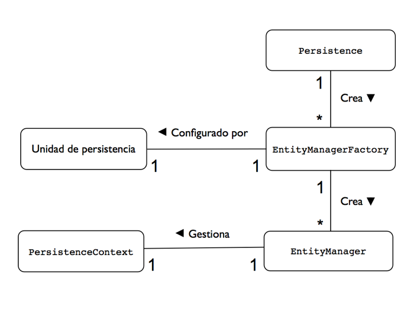

# Java Persistence API (JPA) 

Es una tecnología Java que permite trabajar con entidades persistentes conectadas a una base de datos.

Tiene su origen en el framework **Hibernate**, un conjunto de librerías que implementan un mapeado ORM (Mapeado Objeto-Relacional) desarrollado por Gavin King y un grupo de colaboradores a finales de 2001. Al principio Hibernate no era parte del estándar Java soportado por Sun (antiguo Oracle), sino que se desarrolló de forma independiente como un proyecto Java open source.

La idea de trabajar con entidades persistentes es intentar aplicar las ideas de la POO a las bases de datos, de forma que las clases y los objetos de una aplicación puedan ser almacenados, modificados y buscados de forma eficiente en unidades de persistencia.

Una de las características principales de JPA es su simplicidad. JPA utiliza anotaciones y configuración por defecto, de forma que el desarrollador sólo tiene que especificar aquellas características que necesita que sean distintas de las de por defecto. 

## Implementaciones de JPA

La más popular es <b>Hibernate</b>, que también se incluye en el servidor de aplicaciones JBoss. Otras implementaciones gratuitas son <b>Apache OpenJPA</b>, <b>ecliselink</b>. <b>MyBatis</b> y <b>Oracle TopLink</b>. Una implementación comercial de JPA existente en la actualidad es <b>CocoBase PURE POJO</b>.

## Introducción al proyecto

Este proyecto está hecho con JPA, Hibernate y Maven. Aunque esta también preparado para funcionar con EclipseLink solamente cambiando las dependencias en el pom.xml.

Si te da error este proyecto al importarlo hacer botón derecho sobre el proyecto -> Maven -> Update Maven Proyect para bajarte las librerías que necesita este proyecto de internet

## Configuracion de proyecto con maven

Para evitar problemas de dependencias, podemos hacer un proyecto Maven y que sea este el que nos lleve las dependencias del proyecto. Para ello ver el proyecto 30_Maven por si necesitamos más información

Una vez creado el proyecto Maven, debemos de configurar y crear las clases de entidad y anotarlas adecuadamente. En este caso, la clase Persona es la que vamos a anotar.

Por último, debemos de configurar el fichero META-INF/persistence.xml que se encuentra en src/main/resoruces. Es importante que se encuentre en la carpeta META-INF. Este fichero va a llevar la configuración de nuestra BBDD y las clases que van a ser mapeadas a la BBDD.

Lo más importante a tener en cuenta:

1. Decir las clases que vamos a mapear a la BBDD (en este caso la clase Persona)

2. Configurar el fichero META-INF/persistence.xml con las propiedades de la BBDD. Las tablas en la BBDD NO es necesario crearlas, ya JPA puede crearlas mediante la siguiente propiedad: 

	<property name="javax.persistence.schema-generation.database.action" value="update"/>

## Anotaciones en JPA

El Entity Manager(EM) debe de saber cómo tiene que mapear las clases a la BBDD, ya que debe poder crear una nueva instancia de la entidad cuando queramos buscarla e insertar en ella los datos obtenidos de base de datos para poder ser leídos, y además debe ser capaz leer los datos guardados en la entidad para volcarlos en la base de datos. 

Normalmente crearemos clases POJO que representan entidades y las anotaremos para que puedan ser gestionadas por el Entity Manager. 

Entre las anotaciones más importantes podemos encontrar las siguientes: 

1. <b>@Entity</b>, esta anotación se pone encima de una clase, y le estamos diciendo al EM que dicha clase será una tabla en BBDD. Por defecto se llamará en la BBDD como se llame la clase, pero todo en minúsculas. Por defecto cogerá todos sus atributos y los convertirá en columnas en la BBDD. 

2. <b>@Table</b>, esta anotación va encima de la clase y sirve para alterar la tabla que nos creara JPA, normalmente para cambiar el nombre de la tabla. 

3. <b>@Id</b>, esta anotación se pone en un atributo y representa el atributo que será la “primary key” de la tabla. 

4. <b>@GeneratedValue</b>, esta anotación va acompañada de la anotación @id, y representa que la clave primaria será auto incrementada por la BBDD. Tiene varios posibles valores en función de la BBDD 

5. <b>@Column</b>, esta anotación se pone encima de un atributo y sirve para modificar las propiedades de la columna de BBDD. Recordemos que por defecto JPA nos convertirá todos los atributos de una clase a columnas, y el nombre por defecto de la columna será el mismo que el del atributo. Con esta anotación podemos por ejemplo cambiar el nombre que tendrá la columna en BBDD o por ejemplo permitir que sea nulo el campo en BBDD. 

6. <b>@Temporal</b>, esta anotación se pone encima de un atributo y sirve principalmente para trabajar con fechas (clase java.util.Date). 

7. <b>@Transient</b>, esta anotación se pone encima de un atributo y sirve para decirle a JPA que dicho atributo no queremos que se persista en BBDD, por lo que tampoco creara el campo correspondiente. 

8. <b>@Enumerated</b>, esta anotación se pone encima de un atributo y sirve para trabajar con enumerados. 
 
Existen otras anotaciones importantes para establecer relaciones que veremos en otros ejemplos, principalmente anotaciones para hacer relaciones con otras clases (one to one, one to many...) 

## Entity Manager y Contexto de Persistencia 

Todas las operaciones relacionadas con la persistencia de las entidades se realizan a través de un gestor de entidades. 

El entity manager tiene dos responsabilidades fundamentales: 

1. Define una conexión transaccional con la base de datos que debemos abrir y mantener abierta mientras estamos realizado operaciones. En este sentido realiza funciones similares a las de una conexión JDBC. 

2. Mantiene en memoria una caché con las entidades que gestiona y es responsable de sincronizarlas correctamente con la base de datos. El conjunto de entidades que gestiona un Entity Manager se denomina su contexto de persistencia. 

El Entity Manager se obtiene a través de una factoría del tipo EntityManagerFactory, que se configura mediante la especificación de una unidad de persistencia definida en el fichero XML “persistence.xml”. En el fichero pueden haber definidas más de una unidad de persistencia, cada una con un nombre distinto. La unidad de persistencia define las características concretas de la base de datos con la que van a trabajar todos los entity managers obtenidos a partir de esa factoría y queda asociada a ella en el momento de su creación. Existe, por tanto, una relación uno-a-uno entre una unidad de persistencia y su EntityManagerFactory concreto. Para obtener una factoría EntityManagerFactory debemos llamar a un método estático de la clase Persistence. 

 

Una vez creado el Entity Manager lo utilizaremos para realizar todas las operaciones de recuperación, consulta y actualización de entidades. Cuando un EM obtiene una referencia a una entidad, se dice que la entidad está gestionada (una managed entity en inglés) por él. El EM guarda internamente todas las entidades que gestiona y las utiliza como una caché de los datos en la base de datos. Por ejemplo, cuando va a recuperar una entidad por su clave primaria, lo primero que hace es consultar en su caché si esta entidad ya la ha recuperado previamente. Si es así, no necesita hacer la búsqueda en la base de datos y devuelve la propia referencia que mantiene. Al conjunto de entidades gestionadas por un EMyse le denomina su contexto de persistencia (persistence context en inglés). 

En un determinado momento, el EMydebe volcar a la base de datos todos los cambios que se han realizado sobre las entidades. También debe ejecutar las consultas JPQL definidas. Para ello el EM utiliza un proveedor de persistencia (persistence provider en inglés) que es el responsable de generar todo el código SQL compatible con la base de datos. 

### Obtencion del EntityManager 

Cuando estamos usando JPA gestionado por una aplicación Java SE, el EMyse obtiene a partir de un EntityManagerFactory. Para obtener la factoría se debe llamar al método estático createEntityMagerFactory() de la clase Persistence. En este método se debe proporcionar el nombre de la unidad de persistencia que vamos a asociar a la factoría. 
 
	EntityManagerFactory emf = Persistence.createEntityManagerFactory("NOMBRE_UNIDAD_PERSISTENCIA"); 

Una vez que tenemos una factoría, podemos obtener fácilmente un EntityManager: 

	EntityManager em = emf.createEntityManager(); 

Es muy importante considerar que los objetos EntityManager no son thread-safe. Cuando los utilicemos en Servlets, por ejemplo, deberemos crearlos en cada petición HTTP. De esta forma se evita que distintas sesiones accedan al mismo contexto de persistencia. Si queremos que una sesión HTTP utilice un único EM, podríamos guardarlo en el objeto HtttpSession y acceder a él al comienzo de cada petición. El objeto EntityManagerFactory a partir del que obtenemos los EM sí que es thread-safe. 

### Contexto de persistencia 

Una cuestión muy importante para entender el funcionamiento del EM es comprender su contexto de persistencia. Contiene la colección de entidades gestionadas por el EM que están conectadas y sincronizadas con la base de datos. Cuando el EM cierra una transacción, su contexto de persistencia se sincroniza automáticamente con la base de datos. Sin embargo, a pesar del importante papel que juega, el contexto de persistencia nunca es realmente visible a la aplicación. Siempre se accede a él indirectamente a través del EM y asumimos que está ahí cuando lo necesitamos. 

Es también fundamental entender que el contexto de persistencia hace el papel de caché de las entidades que están realmente en la base de datos. Cuando actualizamos una instancia en el contexto de persistencia estamos actualizando una caché, una copia que sólo se hace persistente en la base de datos cuando el EM manda la información de las instancias en la base de datos. 

Es muy importante darse cuenta de la diferencia entre el contexto de persistencia y la base de datos propiamente dicha. La sincronización no se realiza hasta que el EM vuelca los cambios a la base de datos. 

## Operaciones del Entity Manager 

Podemos encontrar métodos importantes dentro del EM: 

1. <b>EntityTransaction getTransaction():</b> devuelve la transacción actual. Fundamental para métodos que modifiquen la base de datos, pero no necesarios para acceder a información. 

2. <b>void persist(Object entity):</b> hace una entidad persistente y gestionada. 

3. <b><T> T merge(T entity):</b> incorpora una entidad al contexto de persistencia, haciéndola gestionada. Normalmente usado para modificar. 

4. <b><T> T find(Class<T>, Object key):</b> busca por clave primaria 

5. <b>void remove(Object entity):</b> elimina la entidad 

6. <b>void clear():</b> borra el contexto de persistencia, desconectando todas sus entidades. Dicho de otra manera, vacia la cache completa 

7. <b>void detach(Object entity):</b> elimina la entidad del contexto de persistencia, dejándola desconectada de la base de datos. Como el metodo clear() pero solamente para una entidad. 

8. <b>void flush():</b> sincroniza el contexto de persistencia con la base de datos. También podemos hacerlo haciendo un commit(). 

9. <b>boolean contains(Object entity):</b> comprueba si una entidad está gestionada en el contexto de persistencia 

10. <b>Query createNamedQuery(String name):</b> obtiene una consulta JPQL precompilada 

11. <b>void refresh(Object entity):</b> refresca el estado de la entidad con los valores de la base de datos, sobrescribiendo los cambios que se hayan podido realizar en ella 

Vamos a ver en más detalle los más importantes 

### Persist para hacer persistente una entidad 

El método **persist()** del EntityManager acepta una nueva instancia de entidad y la convierte en gestionada. Si la entidad que se pasa como parámetro ya está gestionada en el contexto de persistencia, la llamada se ignora. 

El hecho de convertir una entidad en gestionada no la hace persistir inmediatamente en la base de datos. La verdadera llamada a SQL para crear los datos relacionales no se generará hasta que el contexto de persistencia se sincronice con la base de datos. Lo más normal es que esto suceda cuando se realiza un “commit” de la transacción. 

Si se llama a “persist()” fuera de una transacción la entidad se incluirá en el contexto de persistencia, pero no se realizará ninguna acción hasta que la transacción comience y el contexto de persistencia se sincronice con la base de datos. 

La operación “persist()” se utiliza con entidades nuevas que no existen en la base de datos. Si se le pasa una instancia con un identificador que ya existe en la base de datos el proveedor de persistencia puede detectarlo y lanzar una excepción al gestionarla o al intentar guardarla en BBDD (dependiendo de la implementación de JPA que estemos usando) 

Ver ejemplo _01_CrearPersonaJPA 

### Merge para modificar entidades 

El método **merge(Object o)** permite volver a incorporar en el contexto de persistencia del EM una entidad que habrá sido desconectada. Debemos pasar como parámetro la entidad que queremos incluir.  

Normalmente este método se utiliza para modificar información en base de datos, aunque puede ser usado para dar de alta en un momento dado debido a su peculiar uso. 

Podemos identificar las siguientes casuísticas:

1. El objeto pasado tiene datos y valor en el id, es decir, un caso normal de modificación de una entidad.
    - Si el objeto <b>SI</b> lo tiene ya en la caché, mira si los datos cambian y si es así modifica el objeto gestionado (el objeto de cache) y lo marca para un update cuando hagamos el "commit" o el "flush".
    - Si el objeto <b>NO</b> lo tiene en la caché entonces hará un select para traer el objeto a la cache pero podrá suceder lo siguiente:
        - Que no exista en BBDD: INSERT del objeto en BBDD. Es decir, su comportamiento sería igual que el de un <b>persist()</b>
        - Que exista pero que los datos no cambien: no hace nada
        - Que exista y con datos diferentes: se lo trae, lo modifica con los datos del objeto que pasamos y lo marca para update al hacer commit
	
2. El objeto pasado tiene datos, pero la clave primaria a null -> En este caso insertara el objeto y le asignará un ID, siempre y cuando la clave primaria sea gestionada por la BBDD. Es decir, su comportamiento sería igual que el de un <b>persist()</b>

Hay que tener cuidado con su utilización, porque el objeto que se pasa como parámetro no pasa a ser gestionado. Hay que usar el objeto que devuelve el método. Veamos el siguiente ejemplo para entenderlo mejor, dado el siguiente registro en la tabla: 

	ID	|NOMBRE	|DIR	|TEL 
	---------------------------
	1	|a	|b	|c	 

Ejecutamos el siguiente código 

	Cliente c = new Cliente(1,"A","B",C"); 
	em.merge(c); 
	c.setNombre("F");  
	//El cambio se perderá cuando hagamos el commit, ya que el objeto donde estamos cambiando el valor NO es el objeto gestionado 
	em.commit(); 
	Cliente c = new Cliente(1,"A","B",C"); 
	c = em.merge(c); //Devuelve el objeto que esté la caché 
	c.setNombre("TPM"); //Ahora no se pierde porque la referencia apunta al objeto gestionado por el contexto de persistencia. 
	em.commit(); 

Ver el ejemplo _02_ModificarPersonaJPA 
 
### Find para buscar entidades 

Mediante el método **find()** el EM buscará esa entidad en la base de datos y devolverá la instancia buscada. La entidad devuelta será una entidad gestionada que existirá en el contexto de persistencia actual asociado al EM. 

En el caso en que no existiera ninguna entidad con ese identificador, se devolverá simplemente null. 

Ver ejemplo _03_ObtenerPersonaJPA 

### Remove para borrar entidades 

Un borrado de una entidad realiza una sentencia DELETE en la base de datos. Puede que no sea necesario hacer borrados muy a menudo ya que muchas veces los registros en BBDD se marcan como no activos para no perderlos y recuperarlos en un futuro. 

Es muy importante entender que, para eliminar una entidad, la entidad debe estar gestionada, esto es, debe existir el objeto en el contexto de persistencia. Es por ello que normalmente antes de hacer un <b>remove()</b> del objeto, hagamos un <b>find()</b> del objeto que queramos borrar para que sea gestionado por el EM, o dicho de otra manera, para meterlo en el contexto de persistencia. 

Si intentamos hacer un <b>remove()</b> sobre un objeto no gestionado, dara una excepción al ejecutar el <b>commit()</b>. 

### Actualización de entidades 

Para actualizar una entidad, primero debemos obtenerla para convertirla en gestionada. Después podremos colocar los nuevos valores en sus atributos.  

Podemos hacerlo primero haciendo un “find()” de la entidad que queremos actualizar, y luego modificando los valores del objeto antes de hacer el commit. 

	Persona persona = em.find(Persona.class, 1); 
	persona.setNombre("Tony Stark"); 

En el ejemplo anterior vemos que la referencia está apuntando al objeto gestionado por lo que podemos cambiar sus valores. 

Es muy importante notar que no está permitido modificar la clave primaria de una entidad gestionada. Si intentamos hacerlo, en el momento de hacer un commit la transacción lanzará una excepción. 

## Bibliografía 

- <http://www.java2s.com/Tutorials/Java/JPA/index.htm> 
- <https://www.manning.com/books/java-persistence-with-hibernate> 
- <http://hibernate.org/orm/documentation/5.5/> 
- <https://jcp.org/aboutJava/communityprocess/final/jsr317/index.html> 