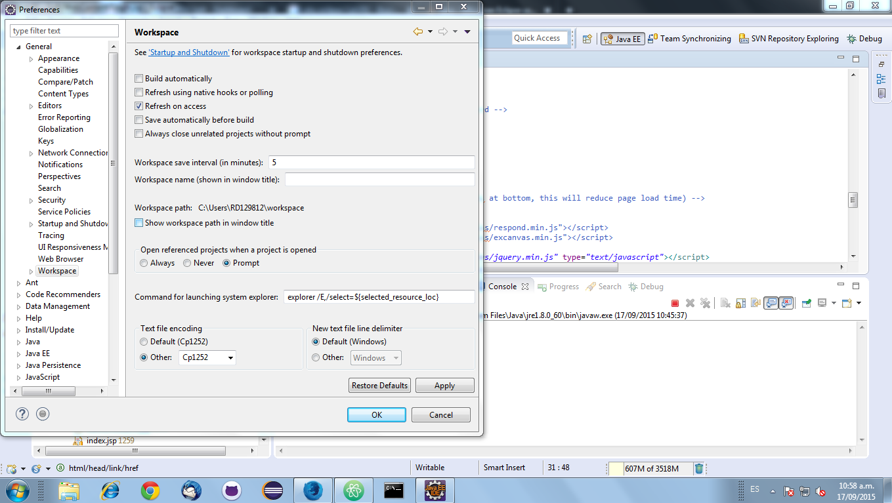

# Java
La plataforma Java es el nombre de un entorno de computación originaria de Sun Microsystems, capaz de ejecutar aplicaciones desarrolladas usando el lenguaje de programación Java u otros lenguajes que compilen a bytecode y un conjunto de herramientas de desarrollo. En este caso, la plataforma no es un hardware específico o un sistema operativo, sino más bien una máquina virtual encargada de la ejecución de las aplicaciones, y un conjunto de bibliotecas estándar que ofrecen una funcionalidad común.

Aqui vamos a encontrar un repositorio de eclipse con teoria y ejemplos sobre java

# Versiones usadas en el repositorio
- Java 17 (aunque hay algún proyecto en la version 1.8)
- Tomcat 9.0

# Instalación y configuración
Lo primero, asegurate que tienes java con su correspondiente versión instalada en el ordenador. Puede funcionar tambien para otras versiones anteriores de java, pero es posible que de algún problema. Si tienes una versión posterior no debería de dar ningún problema.

Para comprobar que versión tienes instada de java puede ejecutar el siguiente comando en una 
ventana de linea de comandos "cmd"

    java -version
	
En caso de que no tengas instalada la versión 17 puedes bajartela del siguiente enlace:

- [https://www.oracle.com/java/technologies/javase/jdk17-archive-downloads.html](https://www.oracle.com/java/technologies/javase/jdk17-archive-downloads.html)

El siguiente paso es decargarte este workspace desde git. Puedes hacerlo clonando el repositorio o puedes hacerlo simplemente bajandote el .zip y descomprimirlo.

- [https://github.com/fdepablo/WorkspaceJava](https://github.com/fdepablo/WorkspaceJava)

Arranca eclipse y selecciona la carpeta raiz del workspace que te has descargado
previamente y has descomprimido.

Una vez abierto el workspace tienes que importar todos los proyectos que están dento de la carpeta, ya que por defecto eclipse no los importa. Sigue los siguientes pasos:
1. En la pestaña de Project Explorer de la derecha pulsamos -> import projects -> General -> Existing Projects into Workpace
2. Con la opcion "Select root directory" pulsamos Browse y seleccionamos nuestra carpeta
raiz donde estan todos estos ejemplos
3. Hecho esto, se nos deberán cargar todos los proyectos en la parte de "Projects", deberan estar todos seleccionados
4. Pulsamos el boton "Finish"
5. Debemos de ver todos los proyectos ahora en la pestaña "Project Explorer"

Una vez hecho esto es posible que los proyectos den problemas debido a que estés usando otra versión de JAVA o tengas instalado java en una ruta diferente a la mia.

Para ello deberás comprobar que el build path de java este correctamente configurado, para
ello hacemos los siguientes pasos.

1. Botón derecho sobre el proyecto.
2. Pulsamos -> Build path -> configure Build Path y se abrirá una ventana
3. En la ventana vamos a la pestaña -> libraries y comprobamos que no hay errores
4. Es posible que de error en la librería java, para solucionarlo pulsamos sobre la librería java y a continuación pulsamos en -> Edit
5. Se abrirá una nueva ventana en la que podemos decirle a eclipse que coja la versión de java que queramos. En principio podemos coger "Workpace default JRE" que sería la versión de java que usa eclipse para este workspace en concreto. Repetiriamos este paso para todos los proyectos que lo necesitemos.

Si algun proyecto aparece con errores, debemos leer su README.md para solucionarlo

## Codificación de caracteres en Eclipse

La mayoría de este workspace está codificado en **UTF-8** por lo que es posible que si se usa otra codificación las tildes u otros caracteres se vean mal. Eclipse, por ejemplo, usa la codificación **Cp1252** por defecto en todos los workspace.

Para cambiar la codificación de un workspace en eclipse realizar los siguientes pasos:

	Window -> Preferences -> General -> Workspace : Text file encoding
	
Una vez ahí, seleccionar el de su preferencia (UTF-8 en este caso)
	

## Visualizar ficheros MarkDown(.md) en las últimas versiones de Eclipse

Las últimas versiones de Eclipse no incluyen un visualizador de ficheros MarkDown, por lo que se tiene que instalar un plugin aparte para poder visualizarlos. El siguiente enlace proporciona información para su instalación:

- [https://stackoverflow.com/questions/72673235/what-happened-to-eclipse-markdown-editor-in-2022-06](https://stackoverflow.com/questions/72673235/what-happened-to-eclipse-markdown-editor-in-2022-06)

## Bibliografia

- [https://docs.oracle.com/en/java/](https://docs.oracle.com/en/java/)

