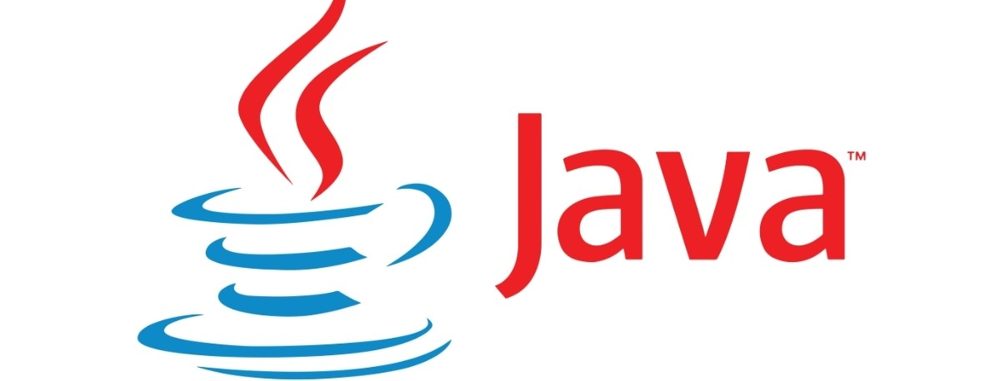

# Java
La plataforma Java es el nombre de un entorno de computación originaria de Sun Microsystems, capaz de ejecutar aplicaciones desarrolladas usando el lenguaje de programación Java u otros lenguajes que compilen a bytecode y un conjunto de herramientas de desarrollo. En este caso, la plataforma no es un hardware específico o un sistema operativo, sino más bien una máquina virtual encargada de la ejecución de las aplicaciones, y un conjunto de bibliotecas estándar que ofrecen una funcionalidad común.

Aqui vamos a encontrar un repositorio de eclipse con teoria y ejemplos sobre java

# Versiones usadas en el repositorio
Java 11
Tomcat 9.0

# Instalación y configuración
Lo primero, asegurate que tienes java con su correspondiente versión instalada
en el ordenador. Puede funcionar tambien para otras versiones de java, pero
es posible de algún problema.

Descargate el workspace desde git.

Arranca eclipse y selecciona la carpeta raiz del workspace que te has descargado
previamente.

Una vez abierto el workspace tienes que importar todos los proyectos que 
estan dento de la carpeta, ya que por defecto eclipse no los importa.

Sigue los siguientes pasos:
1. Project Explorer -> import projects -> General -> Existing Projects into Workpace
2. Con la opcion "Select root directory" pulsamos Browse y seleccionamos nuestra carpeta
raiz donde estan todos estos ejemplos
3. Hecho esto, se nos deberán cargar todos los proyectos en la parte de "Projects", deberan
estar todos seleccionados
4. Pulsamos el boton "Finish"
5. Debemos de ver todos los proyectos ahora en la pestaña "Project Explorer"
6. Si algun proyecto aparece con errores, lee su README.md para solucionarlo

